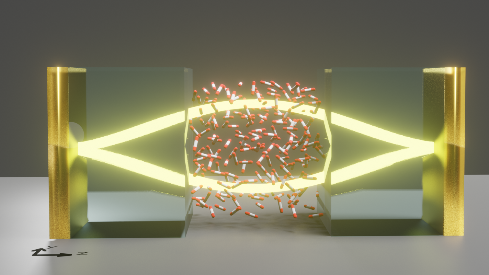

# CavMD: Cavity Molecular Dynamics Simulations

## What is CavMD?

CavMD is an approach to simulate **coupled photon-nuclear dynamics for realistic molecules** in optical or plasmonic cavities under **vibrational strong coupling (VSC)**. By propagating the classical motion of nuclei and cavity photons on an electronic ground-state surface, we can use CavMD to explore possible cavity modifications of molecular properties. This approach is a natural extension of the coupled oscillator model, i.e., both a caivty photon and a molecular bright mode are described by harmonic oscillators. It aims to accurately describe **VSC or vibrational ultrastrong (V-USC) coupling**, i.e., when a few cavity modes are resonantly coupled to a few vibrational normal modes of molecules and a collective Rabi splitting is formed in the molecular infrared (IR) spectrum. Nuclear and photonic quantum effects can be further included in CavMD by path-integral treatments (not reported yet).

This approach is still under development and more features will be reported and updated in the near future.

## What can CavMD do NOW?

- Propagating **nonreactive, classical** molecular dynamics under VSC for both isolated and condensed-phase molecules, where cavity loss or external laser pumping can be included.

- Propagating **nonreactive, quantum** molecular dynamics under VSC via path integrals.

## How to use CavMD?

Please check folder [**"tutorials/"**](tutorials/) for step-by-step introductions.

Please also check the following Github repositories which store the input and post-processing files for reproducing all figures in the publications of CavMD.

- **Nonreactive VSC dynamics** for liquid water under liquid-phase VSC. [https://github.com/TaoELi/cavmd_examples_h2o](https://github.com/TaoELi/cavmd_examples_h2o)

- **Nonreactive VSC dynamics** for liquid carbon dioxide under liquid-phase VSC. [https://github.com/TaoELi/cavmd_examples_co2](https://github.com/TaoELi/cavmd_examples_co2)

For readers who are interested in reproducing the CavMD work, I strongly suggest the readers to first reproduce the work in https://github.com/TaoELi/cavmd_examples_h2o/tree/main/water_trpmd (the classical part) due to its cleaner file structure and documentation.

## Folder structure

- **i-pi-master-py3/**: source code in python 3, the modified i-pi package which enables simulating VSC and V-USC.

- **tutorials/**: a series of tutorials (from installation to a simulation example of CavMD) for exploring different features of CavMD.

## Citations

If you find CavMD useful for your research, please cite:

- Li, T. E., Subotnik, J. E., Nitzan, A. Cavity molecular dynamics simulations of liquid water under vibrational ultrastrong coupling. [Proc. Natl. Acad. Sci., 2020, 117(31), 18324–18331](https://doi.org/10.1073/pnas.2009272117).

If you directly use the provided code in your simulations, please also cite the original [i-pi](http://ipi-code.org/) package which provides a fancy and user-friendly interface for simulating molecular dynamics:

- Kapil, V., Rossi, M., Marsalek, O., Petraglia, R., Litman, Y., Spura, T., … Ceriotti, M., I-PI 2.0: A universal force engine for advanced molecular simulations. [Comput. Phys. Commun., 2019, 236, 214–223.](https://doi.org/10.1016/j.cpc.2018.09.020)

## Publications using CavMD:

- Li, T. E., Subotnik, J. E., Nitzan, A. Cavity molecular dynamics simulations of liquid water under vibrational ultrastrong coupling. [Proc. Natl. Acad. Sci., 2020, 117(31), 18324–18331](https://doi.org/10.1073/pnas.2009272117).

- Li, T. E.; Nitzan, A.; Subotnik, J. E. Cavity Molecular Dynamics Simulations of Vibrational Polariton-Enhanced Molecular Nonlinear Absorption. [J. Chem. Phys. 2021, 154 (9), 094124](https://doi.org/10.1063/5.0037623).

- Li, T. E.; Nitzan, A.; Subotnik, J. E. Collective vibrational strong coupling effects on molecular vibrational relaxation and energy transfer: Numerical insights via cavity molecular dynamics simulations. [Angew. Chem. Int. Ed. 2021, 60(28), 15533-15540]( https://doi.org/10.1002/anie.202103920).

- Li, T. E.; Nitzan, A.; Subotnik, J. E. Energy-efficient pathway for selectively exciting solute molecules to high vibrational states via solvent vibration-polariton pumping. [arXiv. 2021](https://arxiv.org/abs/2104.15121).

- Li, T. E.; Nitzan, A.; Subotnik, J. E. Polariton relaxation under vibrational strong coupling: Comparing cavity molecular dynamics simulations against Fermi's golden rule rate. [arXiv. 2021](https://https://arxiv.org/abs/2111.12770).

- Li, T. E., Nitzan, A., Hammes-Schiffer, S., Subotnik, J. E. Quantum Simulations of Vibrational Strong Coupling via Path Integrals. arXiv.

## Implementation

The implementation of CavMD relies on conventional MD packages. Currently, CavMD is implemented on top of the [i-pi](http://ipi-code.org/) package, which provides a user-friendly interface for nuclear dynamics. Because the [i-pi](http://ipi-code.org/) package is written in python, it enables a fast realization of new algorithms and ideas when the cavity is considered.

In general, i-pi provides an interface to separate the nuclear force evaluation and the rest functions of nuclear dynamics. Currently, CavMD can be performed in i-pi using a new force evaluator: **ffcavphsocket**, which is operated in a similar way as using the original **ffsocket** evaluator but with additional parameters to control the degrees of freedom for cavity photons.

Therefore, performing CavMD simulations is **very easy** in practice: the only background is to know how to perform conventional molecular dynamics outside the cavity with i-pi (which may take one hour to study from scratch), and the inside cavity results can be simulated by adding a few parameters. In short, it is user-friendly to all researchers.
