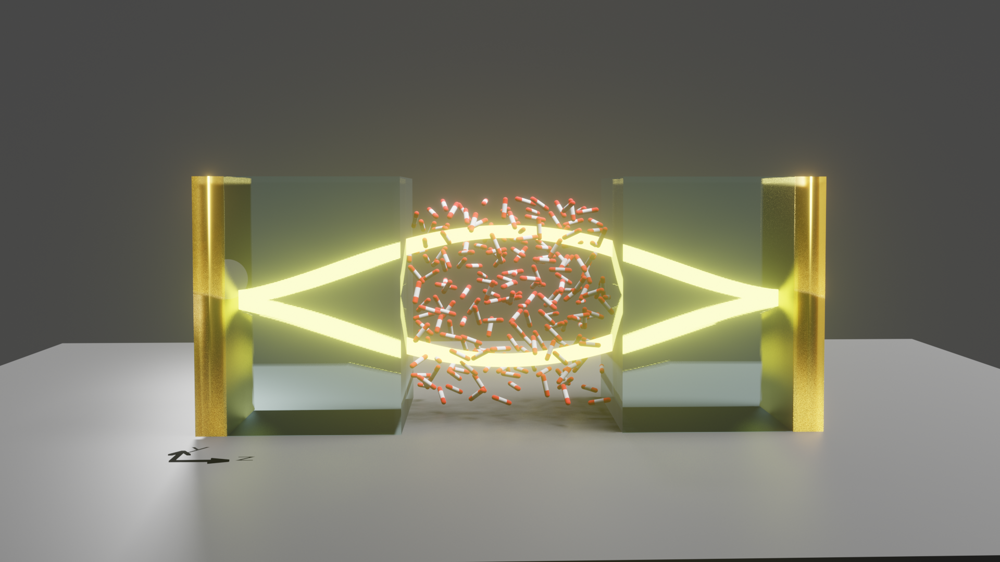

# CavMD: Cavity Molecular Dynamics Simulations

## What is CavMD?

CavMD is an approach to classically simulate coupled photon-nuclear dynamics for realistic molecules in optical microcavities and to explore the possible cavity modifications on molecular properties. This approach is a natural extension of the coupled oscillator model, i.e., both a caivty photon and a molecular bright mode are described by harmonic oscillators. It aims to accurately describe vibrational strong (VSC) or ultrastrong (V-USC) coupling, i.e., when a few cavity modes are resonantly coupled to a few vibrational normal modes of molecules and a collective Rabi splitting is formed in the molecular infrared (IR) spectrum. Nuclear and photonic quantum effects can be further included in CavMD by path-integral treatments (not reported yet).

This approach is still under development and more features will be reported and updated in the near future.

## Why use CavMD?

Experiments have indicated that many molecular properties can be significantly modified under VSC or V-USC, e.g., (i) modification of ground-state chemical reaction rates and chemical selectivity under thermal conditions [(check here)](https://doi.org/10.1126/science.aau7742); and (ii) acceleration of intermolecular vibrational energy transfer rate between different molecular species under laser pumping [(check here)](https://doi.org/10.1126/science.aba3544).

These experimental findings suggest that VSC or V-USC might provide a new means to control chemical or physical processes, which could have a direct impact on both academia or industry. However, there is no good theoretical approach to describe these intriguing experimental findings. Especially, when realistic molecules are studied on top of simplified quantum models, the adjustable parameters (e.g., the magnitude of intermolecular interactions, static disorder, molecular anharmonicity, an proper inclusion of temperature effect, etc.) can become to large to handle, and an improper change of these parameters could yield nonphysical results. Therefore, CavMD is proposed.

## What can CavMD do NOW?

Users can freely use CavMD to study, for an arbitrary molecular system (with a given classical force field), how polaritonic dynamics are altered by (i) cavity loss, (ii) vibrational relaxation rates (to ground state), (iii) poalritonic energy transfer (dephasing) to vibrational dark modes, (iv) molecular anharmonicity,  (v) molecular density, (vi) temperature, etc., and how the formation of polaritons can alter local or invididual molecular properties (which are mostly composed of vibrational dark modes). There are a lot of possibilities which could be investigated, examples include:

- Computation of Rabi splitting in the IR spectrum for realistic molecular systems from VSC to V-USC without fitting experimental parameters. For more details, see [publication](https://doi.org/10.1073/pnas.2009272117) and the corresponding data in folder cavmd_examples/water_VUSC/.

- Description of polariton relaxation and polariton-enhanced multiphoton absorption after an external laser pumping of the polaritons. See [publication](https://doi.org/10.1063/5.0037623) for details and the corresponding data in folder cavmd_examples/CO2_laserPolariton/.

- Description of collective VSC effects on vibrational relaxation and energy transfer for a few hot molecules immersed in a molecular thermal bath. See [publication](https://doi.org/10.1002/ange.202103920) for details and the corresponding data in folder cavmd_examples/CO2_vib_relaxation/.

- An important prediction: Under suitable resonant conditions, exciting a vibrational polariton of the solvent molecules provides an energy-efficient approach to strongly excite the solute molecules to high vibrational states. This finding could potentially be used to catalyze ground-state chemical reactions in liquid phase with an IR pulse, which remains difficult to achieve outside a cavity.  See [preprint](https://arxiv.org/abs/2104.15121) for details and the corresponding data in folder cavmd_examples/selective_excite_solute/.

Other features including cavity catalytic effects are under development and will be released soon.

## Implementation

The implementation of CavMD relies on conventional MD packages. Currently, CavMD is implemented on top of the [i-pi](http://ipi-code.org/) package, which provides a user-friendly interface for nuclear dynamics. Because the [i-pi](http://ipi-code.org/) package is written in python, it enables a fast realization of new algorithms and ideas when the cavity is considered.

In general, i-pi provides an interface to separate nuclear force evaluation and the rest functions of nuclear dynamics. Currently, CavMD can be performed in i-pi using a new force evaluator: **ffcavphsocket**, which is operated in a similar way as using the original **ffsocket** evaluator but with additional parameters to control the degrees of freedom for cavity photons.

Therefore, performing CavMD simulations is **very easy** in practice: the only background is to know how to perform conventional molecular dynamics outside the cavity with i-pi (which may take one hour to study from scratch), and the inside cavity results can be simulated by adding a few parameters. In short, it is user-friendly to all researchers.

## Folder structrucure

- i-pi-master-py3/: source code in python 3, the modified i-pi package which enables simulating VSC and V-USC.

- cavmd_examples/: all inputs to generate the publications on CavMD and also a fresher-friendly tutorial.

- legacy/: legacy code of implementing CavMD with i-pi in python 2. Because python 2 has been no longer officially supported since 2020, all previous python 2 codes are stored in this folder and will not be further developed.

## How to use CavMD?

Please check folder "cavmd_examples/" for step-by-step introductions.

## Citations

If you find CavMD useful for your research, please cite:

- Li, T. E., Subotnik, J. E., & Nitzan, A. (2020). Cavity molecular dynamics simulations of liquid water under vibrational ultrastrong coupling. Proceedings of the National Academy of Sciences, 117(31), 18324–18331. https://doi.org/10.1073/pnas.2009272117

If you directly use the provided code in your simulations, please also cite the original [i-pi](http://ipi-code.org/) package which provides a fancy and user-friendly interface for simulating nuclear dynamics:

- Kapil, V., Rossi, M., Marsalek, O., Petraglia, R., Litman, Y., Spura, T., … Ceriotti, M. (2019). i-PI 2.0: A universal force engine for advanced molecular simulations. Computer Physics Communications, 236, 214–223. [https://doi.org/10.1016/j.cpc.2018.09.020](https://doi.org/10.1016/j.cpc.2018.09.020)

## A complete list of papers using CavMD:

- Li, T. E., Subotnik, J. E., Nitzan, A. Cavity molecular dynamics simulations of liquid water under vibrational ultrastrong coupling. [Proceedings of the National Academy of Sciences. 2020, 117(31), 18324–18331](https://doi.org/10.1073/pnas.2009272117).

- Li, T. E.; Nitzan, A.; Subotnik, J. E. Cavity Molecular Dynamics Simulations of Vibrational Polariton-Enhanced Molecular Nonlinear Absorption. [J. Chem. Phys. 2021, 154 (9), 094124](https://doi.org/10.1063/5.0037623).

- Li, T. E.; Nitzan, A.; Subotnik, J. E. Collective vibrational strong coupling effects on molecular vibrational relaxation and energy transfer: Numerical insights via cavity molecular dynamics simulations. [Angew. Chem. Int. Ed. 2021](https://doi.org/10.1002/ange.202103920).

- Li, T. E.; Nitzan, A.; Subotnik, J. E. Energy-efficient pathway for selectively exciting solute molecules to high vibrational states via solvent vibration-polariton pumping. [arXiv. 2021](https://arxiv.org/abs/2104.15121).
