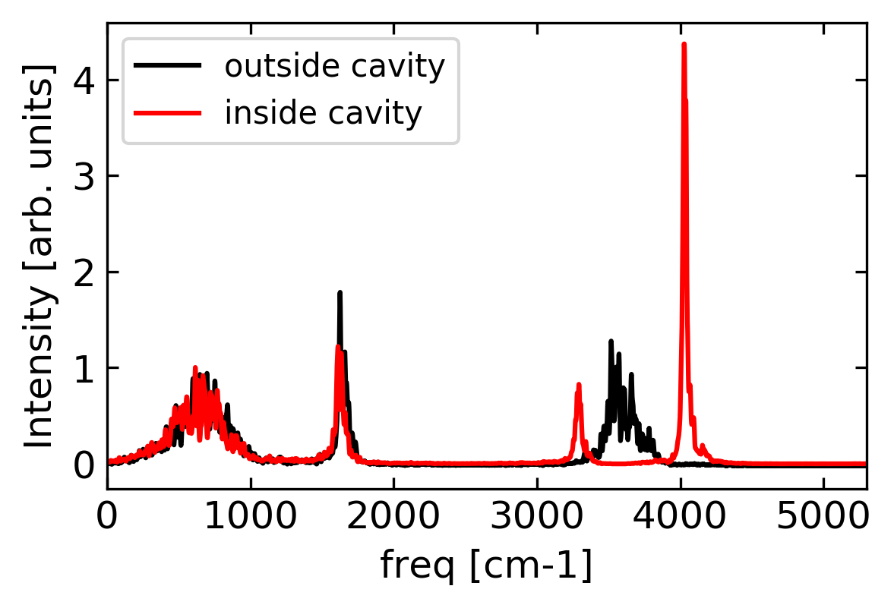

# Installation

1. Install the modified i-pi (in folder ../i-pi-master-py3/) on your personal computer or goverment supercomputer (e.g., NERSC); see [here](http://ipi-code.org/resources/documentation/) for a guide. Here, two simplest installations are provided.

  1.1. Please copy the following commands:
<pre><code>cd which_path_you_download/cavity-md-ipi/i-pi-master-py3/
python3 setup.py build
python3 setup.py install --prefix=~ </code></pre>
which will allow the installation of i-pi at $HOME/bin/i-pi. Please replace **which_path_you_download** to the path you download this github repo. Note that this command requires a predefinition of PYTHONPATH environmental variable. If everything works fine, you can find the installation location by typing
<pre><code> which i-pi </code></pre>

 1.2. Alternatively, please copy the following command to your ~/.bashrc file
<pre><code> source which_path_you_download/cavity-md-ipi/i-pi-master-py3/env.sh </code></pre>
and then
<pre><code> source ~/.bashrc </code></pre>

2. Ensure that a recent version of LAMMPS (say, 2019) is also installed. In Ubuntu, LAMMPS can be installed by <pre><code>sudo apt get install lammps </code></pre> In government supercomputer like NERSC, LAMMPS can be installed by <pre><code> module load lammps </code></pre>

  For more details, see https://lammps.sandia.gov/doc/Install.html.

# First CavMD simulation: Rabi splitting

After the installation of i-pi and LAMMPS, we can run CavMD simulations. Please go to folder tutorials/Rabi_splitting/ and run
<pre><code> i-pi input_traj_1.xml </code></pre> then open a new terminal run <pre><code>lmp < in.lmp </code></pre> After a while (< 0.5 h), you will finish a single 20ps-trajectory simulation of liquid water under vibrational strong coupling. And you can use any software you like to plot the IR spectrum from the xyz trajectory. Note that because only the x- and y-direction are coupled to the cavity, when calculating IR spectrum of liquid water, please only do Fourier transform for  or  to obtain the IR spectrum, where  denotes the total dipole moment along  direction. Alternatively, please run
<pre><code>python3 collect_all_data_N.py ./
</code></pre>
to capture usefull information, where collect_all_data_N.py is a python script I wrote to obtain the information of O-H bond length distribution, O-O pair distribution function, dipole autocorrelation function, center-of-mass veolcity autocorrelation function, etc. This script can be slower than other well developed softwares. Then run
<pre><code>cd test/
python3 plot_single_IR.py
</code></pre>
to obtain the following Rabi splitting spectrum:

As shown above, outside the cavity, the wide O-H stretch (~3550 cm-1) peak (black line) is split to two peaks: the lower polariton (LP) peak and the upper polariton (UP) peak. This peak splitting forms the signature of VSC.

# File structure

After the first CavMD simulation, let us introduce the necessary file to perform CavMD. In tutorials/Rabi_splitting/, the following files are necessary for a CavMD simulation:

- 1. **input_traj_1.xml**: standard i-pi input file with minor modifications
- 2. **init.xyz**: standard xyz file to record the initial structure of molecules + photons
- 3. **in.lmp**: standard LAMMPS input file
- 4. **data.lmp**: standard LAMMPS data file
- 5. **photon_params.json**: parameters to control the cavity photons

Here, **input_traj_1.xml** is the input file for i-pi. The only modification compared with usual i-pi inputs is here:
<pre><code>&lt;ffcavphsocket name='lammps' mode='unix' pbc='False'>
&lt;address>address_you_define&lt;/address>
&lt;/ffcavphsocket>
</code></pre>
Here, the use of **ffcavphsocket** is mandatory to perform CavMD. The grammar of **ffcavphsocket** is largely the same as the original **ffsocket**. The basic function of **ffcavphsocket** is to seperate the coordinates of molecules and photons, and call LAMMPS or other packages (like **ffsocket**) to calculate the bare molecular force, and then calculate the force on photons and also the cavity force on each nucleus. Finally, it will return the overall forces for both nuclei and photons.

Please keep **pbc='False'** to avoid problems in calculating molecular dipoles due to periodic boundary conditions. When calling LAMMPS or other packages, by default **ffcavphsocket** will transform molecular geometry with periodic boundary conditions. In **photon_params.json**, the users can define "nuclei_force_use_pbc" : false to avoid the periodic boundary condition when calling external packages to calculate nuclear forces.

**init.xyz** stores coordinates for both molecules and photons. Because each cavity photon has two polarization directions, please add an even number of **L** element (which represents cavity photons) at the end of **init.xyz** and also make sure the total number of atoms equals to the number of nuclei PLUS the number of the **L** element. For example, by default, CavMD will include one cavity photon with two polarization directions, so one needs to add the following
<pre><code>L -8.65101e+00  1.11541e+00  4.56823e-01
L  5.35376e-01  1.20389e+01 -1.19497e-01
</code></pre>
to the end of xyz file. By default, the first photon is coupled to the cavity in x-direction, and the second photon is coupled to the cavity in y-direction.

**in.lmp** and **data.lmp** are LAMMPS files to control a simulation *outside a cavity*, i.e., only standard molecular information is included. These files can be generated by [moltemplate](https://github.com/jewettaij/moltemplate). Because i-pi calls LAMMPS to calculate the nuclear force, in in.lmp the following fix is necessary:
<pre><code>fix 1 all ipi address_you_define 32345 unix</code></pre>

## Defining photon parameters

**photon_params.json** controls the parameters for cavity photons and obeys the grammar of json files. The simplest structure is shown as follows:
<pre><code>{
"apply_photon" : true,
"eff_mass" : 1.0,
"freqs_cm" : 3550.0,
"E0" : 4e-4
}
</code></pre>

These information are mandatory for cavity MD simulations:
- "apply_photon" denotes whether including cavity effects or not.
- "eff_mass" denotes the effective mass of photons, which is taken as 1.0 a.u. (atomic units) for convenience.
- "freqs_cm" denotes the frequency of the fundamental photon mode in units of wave number.
- "E0" denotes  (effective coupling strength in units of a.u.) for the fundamental photon mode; see [here](https://arxiv.org/abs/2004.04888) for details.

### Advancd I: Multiple Rabi splitting
There are some optional parameters which allow more complicated CavMD simulations. For example, if the **photon_params.json** is
<pre><code>{
  "apply_photon" : true,
  "eff_mass" : 1.0,
  "freqs_cm" : 1775,
  "E0" : 0.0002,
  "n_modes" : 4
}
</code></pre>
The new option "n_modes" will include 4 (four different cavity modes with spacing "freqs_cm") * 2 (two polarization directions) photons, which will allow simulating multiple Rabi splitting, i.e., different cavity modes forms Rabi splittings with different vibrational normal modes of molecules.  Of course, in **init.xyz**, please add 4 * 2 photons at the end. All photon modes are still at x or y-direction. Note that here I do not include the photons with in-plane wave vectors rather than 0.

Remember that "E0" denotes the effective coupling strength for the fundamental (or with smallest frequency) cavity mode. The effective coupling strengths for higher cavity modes are simple functions of "E0" and are predefined by quantum electrodynamics so here they are not allowed to be defined by users.

### Advanced II: Going beyond water simulation

The above definition is OK if the molecules are waters (**init.xyz** reads O H H O H H ...). To go beyond liquid water and to simulate VSC of V-USC of other molecules, please change **init.xyz**, **in.lmp**, and **data.lmp** to the system you are interested in and also add an additional control on **photon_params.json**:
<pre><code>{
  "apply_photon" : true,
  "eff_mass" : 1.0,
  "freqs_cm" : 1775,
  "E0" : 0.0002,
  "n_modes" : 4,
  "charge_array": [0.33, -0.33, ...]
}
</code></pre>
Here, the option "charge_array" will redefine the partial charge of each atom in the order of configurations. The number of partial charges should match the number of atoms in the simulations.

### Advanced III: Pulse excitation
When **photon_params.json** file is defined as follows:
<pre><code>{
  "eff_mass": 1.0, "freqs_cm": 2300.0,
  "add_cw" : true,
  "add_cw_direction": 0,
  "cw_params": [6e-3, 2405.0, 3.14, 100.0, 600.0],
  "cw_atoms": [-1],
  "dt" : 0.5,
  "charge_array": [0.6512, -0.3256, -0.3256, ... ],
  "apply_photon": true,
  "E0":2e-4
}
</code></pre>
Compared with the above parameters, the following parameters are new:
<pre><code>  "add_cw" : true,
  "add_cw_direction": 0,
  "cw_params": [6e-3, 2405.0, 3.14, 100.0, 600.0],
  "cw_atoms": [-1],
  "dt" : 0.5,
</code></pre>
Here,
1. "add_cw" = true/false will tell CavMD whether or not to apply a continuous wave (cw) pulse to the molecules. The default value is false (not applying cw pulse).

2. "add_cw_direction" = 0/1/2 defines the polariton direction of the pulse (0->x, 1->y, 2->z). The default value is 0.

3. The cw pulse takes the form of Amp\*cos(omga\*t + phi) between t=tstart and t=tend. The corresponding parameters are defined as "cw_params": [6e-3, 2405.0, 3.14, 100.0, 600.0], meaning that Amp=6e-3 a.u., omega=2405.0 cm-1, phi=3.14, tstart=100 fs and tend=600 fs. The default value is [1e-3, 3550.0, 3.14, 10.0, 1e4].

4. "cw_atoms" defines which molecule(s) interact with this pulse. "cw_atoms": [-1] means that *all* nuclei interacts with the pulse. If one wants to artificially excite only part of the molecular system, "cw_atoms" can take the value of, e.g., [0, 1, 2], meaning that the first three nuclei are excited while all other nuclei do not feel this pulse. The default value is [0, 1, 2].

5. "dt" defines the time step of simulation. Here, we use 0.5 fs. The default value is also 0.5.

6. Additionally, one can also define "t0", meaning the starting time of simulation. By comparing the starting time t0 with the pulse turning on or off time (tstart or tend), we can control how long the molecules can be exposed to the pulse. The default value of "t0" is 0 so it is not defined above.

Apart from the above **cw** pulse, one can also define a **Gaussian** pulse. A typical Gaussian pulse definition is
<pre><code>  "add_pulse" : true,
  "add_pulse_direction": 0,
  "pulse_params": [1.0, 10.0, 3550.0, 3.14, 20.0],
  "pulse_atoms": [0, 1, 2],
  "dt" : 0.5,
</code></pre>
Here, the Gaussian pulse takes the form: Amp\* exp[-2ln(2)\*(t-t0-4\*tau)^2/tau^2] \* cos(omega\*t + phi). The above parameters are Amp=1.0 a.u., tau = 10.0 fs, omega=3550.0 cm-1, phi=3.14, t0 = 20.0 fs. The Gaussian pulse will be applied at t0 and will be turned off at t0 + 8\*tau.

### More advanced CavMD simulations

For more advanced simulations, please go to each folder and check the corresponding README. We recommend the user to check in the following order:

- water_VUSC/ for computing IR spectrum and other equilibrium properties of liquid water under VSC or V-USC.

- CO2_laserPolariton/ for computing linear and nonlinear VSC dynamics under external laser using pure liquid CO2.
