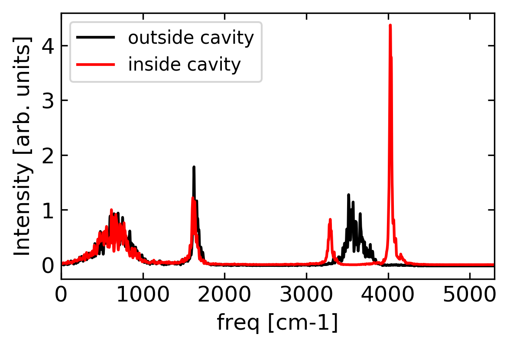

# Table of Contents
1. [Installation](#installation)
2. [First CavMD simulation](#first-cavmd-simulation)
3. [Input file structure of CavMD](#input-file-structure-of-cavmd)
  - [i-pi input file](#i-pi-input-file)
  - [Initial geometry of VSC system](#initial-geometry-of-vsc-system)
  - [Standard LAMMPS input files](#standard-lammps-input-files)
  - [Defining photon parameters](#defining-photon-parameters)
4. [Advanced CavMD simulations](#advanced-cavmd-simulations)
  - [Multiple Rabi splitting](#multiple-rabi-splitting)
  - [Going beyond water simulation](#going-beyond-water-simulation)
  - [Pulse excitation on molecules](#pulse-excitation)
  - [Pulse excitation on cavity modes](#pulse-excitation)
  - [Adding cavity loss](#adding-cavity-loss)
5. [Additional CavMD simulations](#additional-cavmd-simulations)

## Installation

1. Install the modified i-pi (in folder ../i-pi-master-py3/) package on your personal Linux computer or goverment supercomputer (e.g., NERSC); see [here](http://ipi-code.org/resources/documentation/) for a guide. Here, the simplest installation method is provided. We need to work under a python3 (<= 3.8) environment.

  Please open a terminal
```bash
cd which_path_you_download/cavity-md-ipi/i-pi-master-py3/
python3 setup.py build
python3 setup.py install
```
 copy the following command to the end of your ~/.bashrc file
```bash
source which_path_you_download/cavity-md-ipi/i-pi-master-py3/env.sh
```
in the terminal, run
```bash
 source ~/.bashrc
 which i-pi
 ```
 If the output looks similar as
 ```bash
which_path_you_download/cavity-md-ipi/i-pi-master-py3/bin/i-pi
 ```
 it means we have correctly installed the i-pi package.


2. Ensure that a recent version of LAMMPS is also installed.

  2.1. To ensure the functionality of the LAMMPS code, we can install from the source code. Under a linux (Ubuntu or Centos) environment, please download the source code, e.g., [the lammps-stable_3Mar2020 release at Github](https://github.com/lammps/lammps/releases/tag/stable_3Mar2020).

  After downloading **lammps-stable_3Mar2020.tar.gz**, we unpack this tarball to a folder ~/source/,
```bash
tar -xvf  lammps-stable_3Mar2020.tar.gz ~/source/
```
Before installation, we go into this folder and create the build/ folder
```bash
cd ~/source/lammps-stable_3Mar2020/ && mkdir build/ && cd build/   
```
Inside the build/ folder, we now install LAMMPS as follows [https://lammps.sandia.gov/doc/Build_package.html]:
```bash
 cmake -C ../cmake/presets/most.cmake -C ../cmake/presets/nolib.cmake -D PKG_GPU=off ../cmake

 make -j 18
 ```
 We need to include most available packages in LAMMPS and then make file with 18 threads to accelerate the speed (please use the number of threads that your Linux environment supports).

 After this step, you will see the binary file **lmp** in the current folder. Copy this binary file to the folder to your **$PATH** environment, e.g.,
```bash
 cp lmp ~/local/bin/
 ```
where we have assumed that **$PATH** variable contains ~/local/bin/.

  Finally, ensure **lmp** is callable:
```bash
 which lmp
 ```
If everything works fine, you will find the output looks like "~/loca/bin/lmp".

  2.2. **The following methods for "installing" LAMMPS is not guaranteed.**

  Without installing LAMMPS from scratch, in Ubuntu, LAMMPS can be installed by
  ```bash
  sudo apt get install lammps
  ```
  In government supercomputer like NERSC, LAMMPS can be installed by
  ```bash
  module load lammps
  ```

  For more details on the installation of LAMMPS, see https://lammps.sandia.gov/doc/Install.html.


## First CavMD simulation

After the installation of **i-pi** and **LAMMPS**, we can run CavMD simulations. In the folder of this README, please go to [**Rabi_splitting/**](Rabi_splitting/) and run
<pre><code> i-pi input_traj_1.xml </code></pre> then open a new terminal and run <pre><code>lmp < in.lmp </code></pre> After a while (< 0.5 h), you will finish a single 20ps-trajectory simulation of liquid water under vibrational strong coupling. And you can use any software you like to plot the IR spectrum from the xyz trajectory. Note that because only the x- and y-direction are coupled to the cavity, when calculating IR spectrum of liquid water, please only do Fourier transform for  or  to obtain the IR spectrum, where  denotes the total dipole moment along  direction. Alternatively, please run
<pre><code>python3 collect_all_data_N.py ./
</code></pre>
to capture usefull information, where collect_all_data_N.py is a python script I wrote to obtain the information of O-H bond length distribution, O-O pair distribution function, dipole autocorrelation function, center-of-mass veolcity autocorrelation function, etc. This script can be slower than other well developed softwares. Then run
<pre><code>
python3 plot_single_IR.py
</code></pre>
to obtain the following Rabi splitting spectrum:

As shown above, outside the cavity, the wide O-H stretch (~3550 cm<sup>-1</sup>) peak (black line) is split to two peaks: the lower polariton (LP) peak and the upper polariton (UP) peaks. This peak splitting, as called the Rabi splitting, forms the signature of VSC.


## Input file structure of CavMD

After the first CavMD simulation, let us explain the necessary files to perform CavMD. In [**Rabi_splitting/**](Rabi_splitting/), the following files are necessary for a CavMD simulation:

- 1. **input_traj_1.xml**: standard i-pi input file with minor modifications
- 2. **init.xyz**: standard xyz file to record the initial structure of molecules + photons
- 3. **in.lmp**: standard LAMMPS input file
- 4. **data.lmp**: standard LAMMPS data file
- 5. **photon_params.json**: parameters to control the cavity photons

### i-pi input file
Here, **input_traj_1.xml** is the input file for i-pi. The only modification compared with ordinary i-pi inputs is here:
```xml
<ffcavphsocket name='lammps' mode='unix' pbc='False'>
<address>address_you_define</address>
</ffcavphsocket>
```
Here, the use of **ffcavphsocket** is mandatory to perform CavMD. The usage of **ffcavphsocket** is largely the same as the original **ffsocket** function in i-pi. The basic function of **ffcavphsocket** is to seperate the coordinates of molecules and photons, and call LAMMPS or other packages (like **ffsocket**) to calculate the bare molecular force, and then calculate the force on photons and also the cavity force on each nucleus. Finally, it will return the overall forces for both nuclei and photons.

Please keep **pbc='False'** to avoid problems in calculating molecular dipoles due to periodic boundary conditions. When calling LAMMPS or other packages, *by default **ffcavphsocket** will transform molecular geometry with periodic boundary conditions*. In **photon_params.json**, the users can define
```json
"nuclei_force_use_pbc" : false
```
to avoid the periodic boundary condition when calling external packages to calculate nuclear forces.

### Initial geometry of VSC system
**init.xyz** stores the coordinates for both molecules and photons. Because each cavity photon has two polarization directions, please add an even number of **L** element (which represents cavity photons) at the end of **init.xyz** and also make sure the total number of atoms equals to the number of nuclei PLUS the number of the **L** element. For example, by default, CavMD will include one cavity photon with two polarization directions, so one needs to add the following
```python
L -8.65101e+00  1.11541e+00  4.56823e-01
L  5.35376e-01  1.20389e+01 -1.19497e-01
```
to the end of the xyz file. By default, the first photon is coupled to the cavity in x-direction, and the second photon is coupled to the cavity in y-direction.

### Standard LAMMPS input files

**in.lmp** and **data.lmp** are LAMMPS files to control a simulation *outside a cavity*, i.e., only standard molecular information is included. These files can be generated by [moltemplate](https://github.com/jewettaij/moltemplate). Because i-pi calls LAMMPS to calculate the nuclear force, in in.lmp the following fix is necessary:
```python
fix 1 all ipi address_you_define 32345 unix
```

### Defining photon parameters

**photon_params.json** controls the parameters for cavity photons and obeys the grammar of json files. The simplest structure is shown as follows:
```json
{
"apply_photon" : true,
"eff_mass" : 1.0,
"freqs_cm" : 3550.0,
"E0" : 4e-4
}
```

These information are mandatory for cavity MD simulations:
- "apply_photon" denotes whether including cavity effects or not.
- "eff_mass" denotes the effective mass of photons, which is taken as 1.0 a.u. (atomic units) for convenience.
- "freqs_cm" denotes the frequency of the fundamental photon mode in units of wave number.
- "E0" denotes  (effective coupling strength in units of a.u.) for the fundamental photon mode; see [here](https://arxiv.org/abs/2004.04888) for details.

## Advanced CavMD simulations
### Multiple Rabi splitting
There are some optional parameters which allow more complicated CavMD simulations. For example, if the **photon_params.json** is
```json
{
  "apply_photon" : true,
  "eff_mass" : 1.0,
  "freqs_cm" : 1775,
  "E0" : 0.0002,
  "n_modes" : 4
}
```
The new option "n_modes" will include 4 (four different cavity modes with spacing "freqs_cm") * 2 (two polarization directions) photons, which will allow simulating multiple Rabi splitting, i.e., different cavity modes forms Rabi splittings with different vibrational normal modes of molecules.  Of course, in **init.xyz**, please add 4 * 2 photons at the end. All photon modes are still at x or y-direction. Note that here I do not include the photons with in-plane wave vectors other than 0.

Remember that "E0" denotes the effective coupling strength for the fundamental (or with the smallest frequency) cavity mode. The effective coupling strengths for higher cavity modes are simple functions of "E0" and are predefined by quantum electrodynamics so here they are not allowed to be defined by users.

### Going beyond water simulation

The above definition is OK if the molecules are water molecules (**init.xyz** reads O H H O H H ...). To go beyond liquid water and to simulate VSC of V-USC of other molecules, please change **init.xyz**, **in.lmp**, and **data.lmp** to the system you are interested in and also add an additional control on **photon_params.json**:
```json
{
  "apply_photon" : true,
  "eff_mass" : 1.0,
  "freqs_cm" : 1775,
  "E0" : 0.0002,
  "n_modes" : 4,
  "charge_array": [0.33, -0.33, ...]
}
```
Here, the option "charge_array" will redefine the partial charge of each atom in the order of configurations. The number of partial charges should match the number of atoms in the simulations.

### Pulse excitation on molecules
We can simulate a pulse excitation when **photon_params.json** file is defined as follows:
```json
{
  "eff_mass": 1.0, "freqs_cm": 2300.0,
  "add_cw" : true,
  "add_cw_direction": 0,
  "cw_params": [6e-3, 2405.0, 3.14, 100.0, 600.0],
  "cw_atoms": [-1],
  "dt" : 0.5,
  "charge_array": [0.6512, -0.3256, -0.3256, ... ],
  "apply_photon": true,
  "E0":2e-4
}
```
Compared with the above parameters, the following parameters are new:
```json
  "add_cw" : true,
  "add_cw_direction": 0,
  "cw_params": [6e-3, 2405.0, 3.14, 100.0, 600.0],
  "cw_atoms": [-1],
  "dt" : 0.5,
```
Here,
1. "add_cw" = true/false will tell CavMD whether or not applying a continuous wave (cw) pulse to the molecules. The default value is false (not applying a cw pulse).

2. "add_cw_direction" = 0/1/2 defines the polarization direction of the pulse (0->x, 1->y, 2->z). The default value is 0.

3. The cw pulse takes the form of Amp\*cos(omga\*t + phi) between t=t<sub>start</sub> and t=t<sub>end</sub>. The corresponding parameters are defined as "cw_params": [6e-3, 2405.0, 3.14, 100.0, 600.0], meaning that Amp=6e-3 a.u., omega=2405.0 cm<sup>-1</sup>, phi=3.14, t<sub>start</sub>=100 fs and t<sub>end</sub>=600 fs. The default value is [1e-3, 3550.0, 3.14, 10.0, 1e4].

4. "cw_atoms" defines which molecule(s) interact with this pulse. "cw_atoms": [-1] means that *all* nuclei interacts with the pulse. If one wants to artificially excite only part of the molecular system, "cw_atoms" can take the value of, e.g., [0, 1, 2], meaning that the first three nuclei are excited while all other nuclei do not feel this pulse. The default value is [0, 1, 2].

5. "dt" defines the time step of simulation. Here, we use 0.5 fs. The default value is also 0.5.

Apart from the above **cw** pulse, one can also define a **Gaussian** pulse. A typical Gaussian pulse definition is
```json
  "add_pulse" : true,
  "add_pulse_direction": 0,
  "pulse_params": [1.0, 10.0, 3550.0, 3.14, 20.0],
  "pulse_atoms": [0, 1, 2],
  "dt" : 0.5,
```
Here, the Gaussian pulse takes the form: Amp\* exp[-2ln(2)\*(t-t0)^2/tau^2] \* sin(omega\*t + phi). The above parameters are Amp=1.0 a.u., tau = 10.0 fs, omega=3550.0 cm-1, phi=3.14, t0 = 20.0 fs. The Gaussian pulse will be turned on t0 and will be turned off at t0 + 4\*tau.

### Pulse excitation on cavity modes

Similar as external pulse excitation on molecules, we can also use a time-dependent external pulse to drive the cavity modes. However, unlike the molecules which have well-defined dipole moments, the "dipole moment" of cavity modes is not well-defined within our model. Hence, in order to drive the cavity modes with an external field, we to first define the effective dipole moment of the cavity modes. Currently, the effective dipole moment of the cavity modes is defined as

,

where  denotes the effective charge of the cavity modes and can be defined as

```json
  "transition_photon_charge" : 0.05
```
in the atomic units. With this definition, the force of the external field on the cavity modes is simply

.

Apart from the definition of the effective dipole moment (or the effective charge) of the cavity modes, the parameters for controlling the cw wave  is similar as above:
```json
  "transition_photon_charge" : 0.05,
  "add_cw_photon" : true,
  "add_cw_direction": 0,
  "cw_params": [6e-3, 2405.0, 3.14, 100.0, 600.0],
  "cw_atoms": [-1],
  "dt" : 0.5,
```

Similarly, we can define the Gaussian pulse as
```json
  "transition_photon_charge" : 0.05,
  "add_pulse_photon" : true,
  "add_pulse_direction": 0,
  "pulse_params": [1.0, 10.0, 3550.0, 3.14, 20.0],
  "pulse_atoms": [0, 1, 2],
  "dt" : 0.5,
```

All the controlling parameters are similar as above.

### Adding cavity loss

Under vibrational strong coupling, simplified models such as coupled oscillators usually need to introduce two phenomenological parameters: (i) the rate of molecular vibrational energy relaxation to ground state (vibrational linewidth), and (ii) the cavity loss rate, which describes the quality of the cavity (Q factor), or the probability for the confined cavity photon modes to leak their energy outside the cavity.

For CavMD simulations, since a large ensemble of molecules is included and every nuclear degree of freedom is simulated, this approach explicitly simulates the behavior of vibrational energy relaxation to ground state, so it is unnecessary to introduce a phenomenological rate for the molecular part. By contrast, for cavity photons, in CavMD simulations we usually assume perfect cavity mirrors, i.e., cavity loss is zero. In other words, the whole molecular + photonic system conserves energy, so we usually perform CavMD simulations under a NVE ensemble to extract observables. Of course, before running NVE simulations, we need to perform a NVT simulation to fully equilibrate the molecular + photonic system.

In some cases, users want to be capable to add cavity loss and see how the inclusion of cavity loss can modify observables. In other words, while the whole molecular + photonic system is simulated under a NVE ensemble, the cavity photons are connected to a thermal bath with a stochastic damping rate (the cavity loss). Equivalently, the whole molecular + photonic system is simulated under a NVT ensemble, but the interaction between the molecular part and the external bath is prohibited.

This feature is now available in CavMD. To do it, we need to slightly modify the input file **input_traj*.xml** to:
```xml
<motion mode='dynamics'>
  <dynamics mode='nvt'>
    <timestep units='femtosecond'> 0.5 </timestep>
    <thermostat mode='cavloss_langevin'>
      <tau units='femtosecond'> 1000 </tau>
    </thermostat>
  </dynamics>
</motion>
```

Here, we introduce a new thermostat "cavloss_langevin" in NVT simulations, which adds a Langevin thermal bath to the cavity photons only, and &lt;tau units='femtosecond'> defines the magnitude of cavity lifetime (inverse of loss) in the units of fs (which is 1000 fs in the above system).

## Additional CavMD simulations
The input and post-processing files for all publications of CavMD are stored in the following two Github projects:

https://github.com/TaoELi/cavmd_examples_h2o

https://github.com/TaoELi/cavmd_examples_co2

In the above two projects, we studied liquid water / carbon dioxide under VSC.
