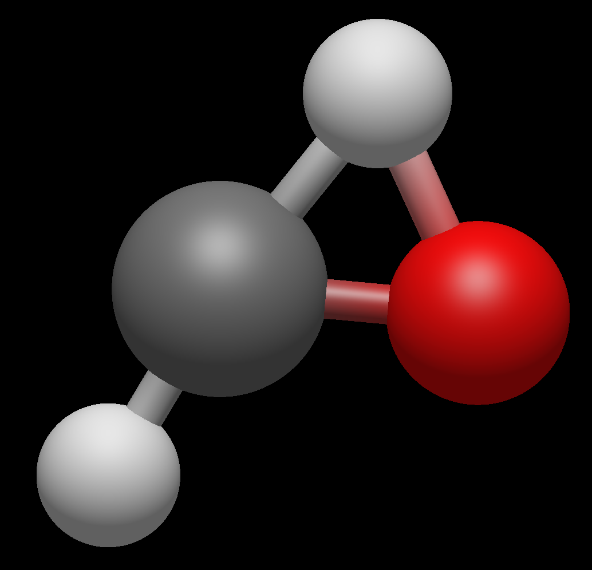

## Single-molecule reaction under vibrational strong coupling

Please click the following link to check the tutorial:

- Jupyter notebook tutorial: **[single_molecule_reaction_vsc.ipynb](https://nbviewer.org/github/TaoELi/cavity-md-ipi/blob/master/tutorials/single_molecule_reaction_vsc/single_molecule_reaction_vsc.ipynb)**

In this tutorial, the cavity effect on the isomerization reaction for CH2O &harr; CHOH will be studied. This molecule has the following transition-state geometry:

